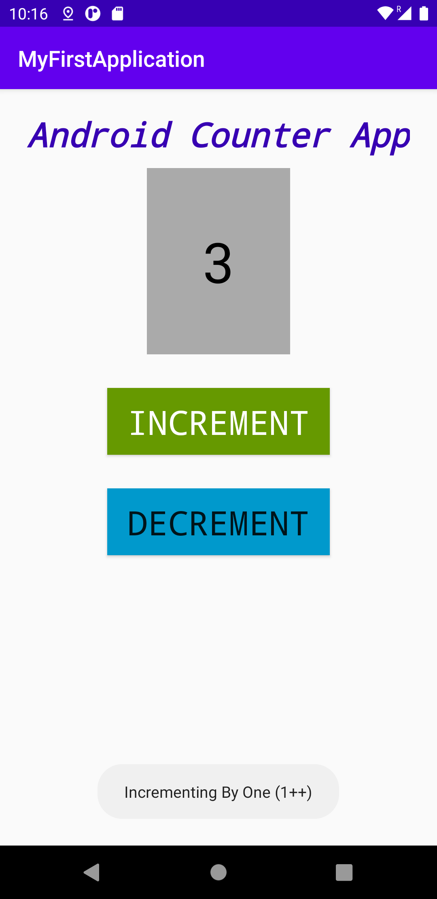

# Android Simple Counter App

#### Description
This app includes 
1. An increment button
2. A decrement button
3. Text View that gets updated when the buttons are pressed
4. Built using a simple Linear Layout
5. Toasts that inform the user when counter is incremented or decremented as shown in the image above.

#### To Run This App:
* Have Java installed
* Install Android Studio : https://developer.android.com/studio/
* Download an emulator or use your android device to trun this app
* Create an Android project or import this file

A great resource to follow along when building your first android app is the [android developer documentation](https://developer.android.com/training/basics/firstapp). 

Best of luck!
